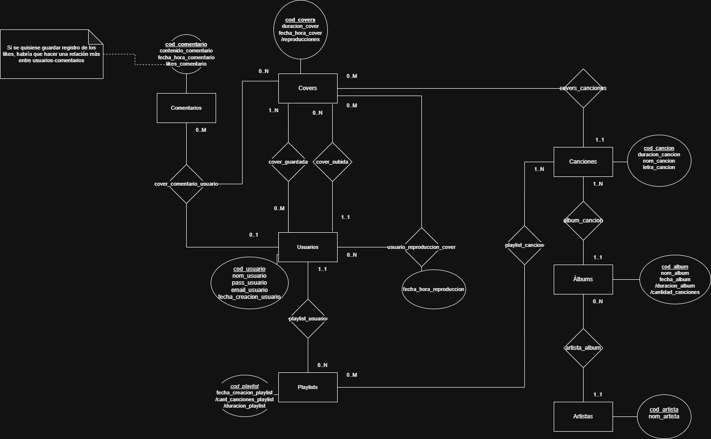

# Freya - Plataforma de Covers de Música

## Grupo

### Integrantes
- 49539 - Salerno, Nicolás
- 50345 - Esteves, Ignacio

### Repositorios
- [front-end](https://github.com/phalanxeyes/freya-java-FE)
- [back-end](https://github.com/phalanxeyes/freya-java-BE)

## Tema

### Descripción

Freya es una plataforma social donde los usuarios pueden compartir y escuchar covers de otros usuarios de canciones de todo tipo de artistas.
Los usuarios logueados pueden subir sus covers seleccionando a qué canción hacen tributo; Pueden también hacer playlists con covers compartidos en la aplicación. Además, los usuarios logueados pueden guardar los covers que hayan sido de su agrado. Los moderadores deciden si los covers subidos son aptos y los confirman para publicarlos. Los administradores pueden administrar nuevas canciones oficiales, así como los álbumes y artistas.

### Modelo

[Link del modelo (Draw.io)](https://drive.google.com/file/d/1L1wkW1Xfm1lXNH6RdNrZrJJFPBhCE_dF/view)

## Casos de Uso para la REGULARIDAD
| Requerimiento | Detalle/Listado de casos incluidos |
| --- | --- |
| ABMC Simple | Crear Usuario, Crear Artista |
| ABMC Dependiente | Subir Cover |
| CU NO-ABMC | Subir y aprobar cover |
| Listado Simple | Listado de covers por cada usuario |
| Listado Complejo | - |

## Casos de Uso para la AP DIRECTA
| Requerimiento                | Detalle/Listado de casos incluidos                                                                            |
| ---------------------------- | ------------------------------------------------------------------------------------------------------------- |
| CU "Complejo"(nivel resumen) | Administrador sube cancion oficial, Usuario sube cover de ella, Moderador lo evalúa                           |
| Listado complejo             | Listado de Comentarios de Un Usuario, separadas por Cover. Filtros por fecha; Mayor o menor y rango de fecha. |
| Nivel de acceso              | No-Logged Usuario, Logged Usuario, Moderador, Administrador                                                   |
| Manejo de errores            | Manejo de errores a nivel API, expuestos en UI.                                                               |
| Publicar el sitio            | -                                                                                                             |

### Requerimientos extra - AD
| Requerimiento | Detalle/Listado de casos incluidos |
| --- | --- |
|  | |
